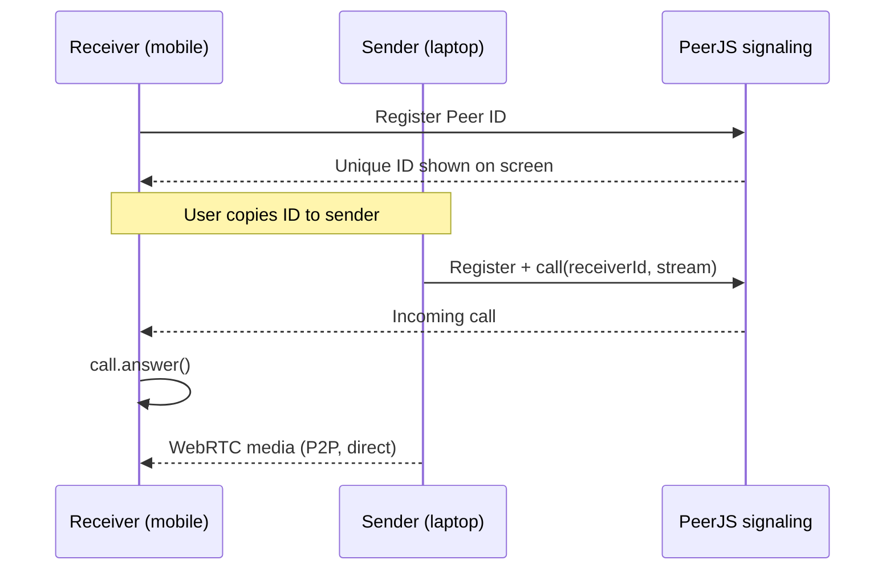

# WebRTC Browser-to-Browser Screen Share

A minimal tutorial showing how two browsers can establish a **peer-to-peer (P2P)** connection and stream video **without running your own backend server**. One device shares its screen; the other watches the stream directly over WebRTC.

The demo uses [PeerJS](https://peerjs.com/) to simplify signaling (finding each other by ID). **Media (video) travels directly between browsers** once the connection is up — not through your Python static file server.

## What You'll Build

| Role | Device (example) | What it does |
|------|------------------|--------------|
| **Receiver** | Mobile phone | Opens the page, gets a unique **Peer ID**, waits for incoming stream |
| **Sender** | Laptop | Enters the mobile's Peer ID, captures screen, streams to the phone |

**Typical flow:** Laptop shares screen → Mobile receives and displays it.

> **Note:** Mobile browsers generally **block** `getDisplayMedia()` (screen/tab capture). In practice you can share **laptop → mobile**, but not reliably **mobile screen → laptop**. Use a desktop browser (Chrome, Edge, or Safari) as the **Sender**.

## Quick Start

### 1. Serve the page locally

From the project folder:

```bash
python -m http.server
```

This starts a static server on **port 8000** by default. Open:

```
http://localhost:8000/webrtc.html
```

### 2. Expose the server to the internet (VS Code)

So your friend (or your phone on another network) can reach the page:

1. In **VS Code**, open **Ports** (or **Port Forwarding**).
2. Forward port **8000**.
3. Set visibility to **Public**.
4. Copy the forwarded URL and share it with the other device.

Both devices must load the **same** `webrtc.html` URL (your forwarded link).

### 3. Connect laptop ↔ mobile

1. **Laptop:** Open the shared link → choose **Sender** (Share).
2. **Mobile:** Open the same link → choose **Receiver** (Receive).
3. On the mobile screen, copy the **Peer ID** (use the copy button).
4. On the laptop, paste that ID into **Receiver's Peer ID**.
5. Click **Start Screen Share** on the laptop and allow screen capture when prompted.

When it works, the mobile shows the laptop screen in the **Incoming Stream** video — a live P2P stream.

## How It Works (High Level)



1. **Receiver** creates a `Peer` and displays its ID when `open` fires.
2. **Sender** captures the screen with `getDisplayMedia()`, then `peer.call(remoteId, localStream)`.
3. **Receiver** handles `peer.on('call')`, calls `call.answer()`, and plays the remote stream on a `<video>` element.

Signaling (IDs, offer/answer) goes through PeerJS's infrastructure. **Your video does not** — it uses WebRTC data paths between the two browsers.

## Important APIs & Functions

### Screen capture — `getDisplayMedia()`

The sender asks the browser for a screen/window/tab capture:

```javascript
navigator.mediaDevices.getDisplayMedia({
  video: { frameRate: 15, width: { ideal: 1280 }, height: { ideal: 720 } },
  audio: false
});
```

This returns a `MediaStream` attached to the laptop display. If the user cancels the picker or the browser does not support capture (common on mobile), sharing fails.

### Peer identity — `new Peer()`

```javascript
peer = new Peer(undefined, { debug: 2 });
```

Creates a peer with an auto-generated ID. On the receiver, `peer.on('open', (id) => …)` exposes that ID for the sender to dial.

### Outgoing call (sender) — `peer.call()`

```javascript
const call = peer.call(remoteId, localStream);
```

Starts a WebRTC call to the receiver's Peer ID and sends the screen `MediaStream`.

### Incoming call (receiver) — `peer.on('call')` + `call.answer()`

```javascript
peer.on('call', (call) => {
  call.answer(); // receiver has no local camera stream
  call.on('stream', (remoteStream) => { /* play video */ });
});
```

`answer()` completes the handshake so media can flow from sender to receiver.

### Playing remote video — `srcObject` + `play()`

```javascript
video.srcObject = remoteStream;
video.muted = true;      // helps autoplay policies
video.playsInline = true; // required on iOS
video.play();
```

Mobile Safari often blocks autoplay unless the video is muted and `play()` is called explicitly.

### Stream lifecycle — track events & cleanup

```javascript
vTrack.onended = () => stopSharing();
localStream.getTracks().forEach(t => t.stop());
call.close();
peer.destroy();
```

Stopping tracks and destroying the peer releases camera/screen capture and closes the P2P connection.

### Under the hood (WebRTC)

PeerJS wraps the standard WebRTC stack you would otherwise wire by hand:

| Concept | Role in a video call |
|--------|----------------------|
| `RTCPeerConnection` | Negotiates codecs, network paths, encryption |
| SDP offer/answer | Describes what each side wants to send/receive |
| ICE candidates | Discovers how to reach the other peer (NAT traversal) |
| `MediaStream` / tracks | Actual video (and optional audio) payloads |

In this project you use PeerJS's `call` / `answer` / `stream` events instead of calling `createOffer`, `setRemoteDescription`, etc. directly.

## Project Structure

```
webrtc/
├── README.md       # This file
└── webrtc.html     # Single-page sender/receiver UI + PeerJS logic
```

## Troubleshooting

| Problem | Things to try |
|--------|----------------|
| Connection fails / invalid Peer ID | Confirm both devices use the **same** forwarded URL; copy the ID again from the receiver |
| No video on mobile | Tap play if Safari paused the element; check sender status shows "Live" |
| Screen share not offered on phone | Expected — use **desktop as Sender**, **mobile as Receiver** |
| iPhone as sender | Safari on iOS usually does not support web screen capture; use laptop Chrome/Edge/Safari |
| Firewall / corporate network | Some networks block WebRTC UDP; try another network or hotspot |

## Requirements

- Modern desktop browser for **Sender** (Chrome, Edge, or Safari recommended)
- Any modern browser for **Receiver**
- HTTPS or localhost is **not** strictly required for `getDisplayMedia` on desktop, but **public port forwarding** should use the URL VS Code provides (often HTTPS)
- Outbound internet for PeerJS signaling (first connection only)

## License

Tutorial / demo project — use and modify freely for learning.
